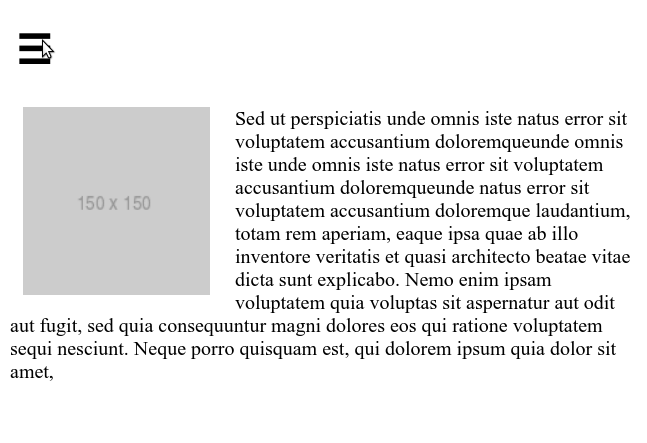
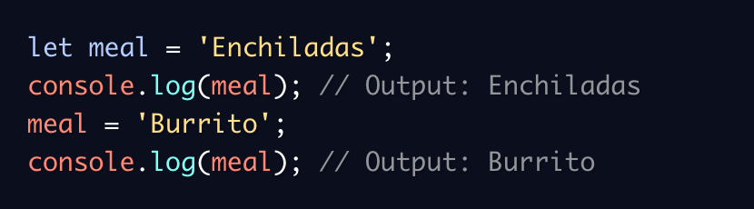
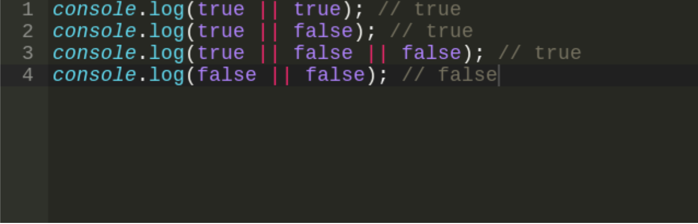

# MINGGU Ke-1

## Unix and Command Line

- **CLI (Command Line Interface)**<br />
  CLI merupakan antarmuka pengguna berbasis teks ( UI ) yang digunakan untuk menjalankan program, mengelola file komputer, dan berinteraksi dengan komputer. CLI sering juga disebut sebagai shell berbasis teks.<br /> 
  Contoh CLI :
  1. sh
  2. bash
  3. zsh
  4. cmd.exe
- **Shell** <br />
  Shell merupakan program yang digunakan untuk berkomunikasi atau memerintah sistem.
- **Terminal Emulator** <br />
  Merupakan aplikasi untuk mengakses CLI.
- **File System Structure** <br />
  Sebuah filesystem mengatur bagaimana data disimpan di dalam sebuah system.
- **Command untuk Navigasi**
    1. pwd (Print working directory) <br />
    Command untuk melihat current working directory
    2. ls (Lists) <br />
    Command untuk melihat isi file yang ada di sebuah direktori
    3. cd (change directory) <br />
    Command untuk berpindah direktori.
- **Manipulasi File dan Direktori**
    1. touch <br/>
    Command untuk membuat sebuah direktori.
    1. mkdir <br/>
    Command untuk membuat sebuah direktori.
    1. head <br/>
    Command untuk melihat beberapa line awal dari sebuah file text.
    1. tail <br/>
    Command untuk melihat beberapa line awal dari sebuah file text.
    1. cat <br/>
    Command untuk melihat isi sebuah file.
    1. cp <br/>
    Command untuk mengcopy files atau directory.
    1. mv <br/>
    Command untuk memindahkan files atau directory. Bisa digunakan untuk rename.
    1. rm <br/>
    Command untuk menghapus file atau directory.

## Git & Github 
  Git adalah aplikasi yang dapat melacak setiap perubahan yang terjadi pada suatu folder atau file. Git biasanya digunakan oleh para programmer sebagai tempat penyimpanan file pemrograman mereka, karena lebih efektif. File -file yg disimpan menggunakan git akan terlacak seluruh perubahannya, termasuk siapa yang mengubah.
  - Instalasi Git <br/>
  Peringatan: email yang disetup HARUS SAMA dengan yang digunakan pada GITHUB
    1. Download dan jalankan hasil download GIT kamu seperti instal aplikasi pada umumnya
    2. Melakukan setup awal seperti gambar berikut:
    
    3. Cek instalasi berhasil seperti gambar berikut:
    
  - Repositori Git <br/>
    Repository adalah direktori proyek yang kita buat. 1 Repo =  1 Proyek = 1 Direktori. <br/>
    Cara membuat repositori:
    1. Menggunakan command line seperti gambar berikut:
    
    2. Jika telah membuat repo, dapat menggunakan command line seperti gambar berikut:
    
  - Perintah dasar git yang lain
    1. git status <br/>
    Perintah git status menampilkan daftar file yang berubah bersama dengan file yang ingin di tambahkan atau di-commit. <br/>

            git status
    2. git add <br/>
    Perintah git add bisa digunakan untuk menambahkan file ke index. Seperti contoh, perintah berikut akan menambahkan file bernama teks.html yang ada di direktori lokal ke index: <br/>

            git add teks.html
    3. git commit <br/>
    Perintah git commit digunakan untuk melakukan commit pada perubahan ke head. Ingat bahwa perubahan apapun yang di-commit tidak akan langsung ke remote repository.
    
            git commit –m “Isi dengan keterangan untuk commit”
    4. git log <br/>
    Dengan menjalankan peritah ini akan menampilkan daftar commits yang ada di branch beserta detail-nya.
    
    5. git checkout <br/>
    Perintah git checkout bisa digunakan untuk membuat branch atau untuk berpindah diantaranya. Misalnya, perintah berikut ini akan membuat branch baru dan berpindah ke dalamnya:
    
            command git checkout -b <nama-branch>
        Untuk berpindah dari branch satu ke lainnya, gunakan:
          
            git checkout <branch-name>
    6. git reset <br/>
    Untuk me-reset index dan bekerja dengan kondisi commit paling baru, gunakan perintah git reset:

            git reset --hard HEAD
    7. git revert <br/>
    Perintah git revert akan mengembalikan kondisi berkas yang ada dimasa lalu, selanjutnya akan digabungkan dengan commit -an terakhir dimasa sekarang.
    
            git revert -n <nomer commit>
    8. git branch <br/>
    Perintah git branch bisa digunakan untuk me-list, membuat atau menghapus branch. Untuk menampilkan semua branch yang ada di repository, gunakan:

            git branch
        Untuk menghapus branch:
        
            git branch -d <branch-name>
    9. git merge<br/>
    Perintah merge digunakan untuk menggabungkan sebuah branch ke branch aktif. 

            git merge <nama-branch>
## HTML (Hypertext Markup Language)
HTML adalah bahasa komputer yang digunakan untuk membuat kerangka atau struktur untuk Web pages (halaman website) di internet. Selain HTML, ada juga bahasa CSS (Cascading Style Sheet) dan JavaScript yang akan kita pelajari untuk membuat sebuah tampilan website yang interaktif. Secara fungsi, ketiga bahasa tersebut bisa dianalogikan seperti ini:

HTML bersifat statis, HTML hanya bertugas menampilkan konten yang diminta oleh developer.HTML bukanlah sebuah bahasa pemrograman, artinya HTML tidak bisa dinamis mengolah data. <br/>
Ada 2 tools utama yang harus dipersiapkan untuk membuat HTML:
1. Browser
2. Code Editor

Terdapat beberapa tag HTML dan element yang digunakan:
- HTML tag <br/>
  HTML terdiri dari komponen yang disebut HTML Tag. Pada umumnya, ada 2 tipe HTML Tag:
  - Opening Tag (tag pembuka) - contohnya adalah
            
          <p>.
  - Closing Tag (tag penutup) - contohnya adalah 
  
          </p>.
- Struktur Dokumen HTML<br/>
Dokumen HTML memiliki 3 tag utama, yaitu html,head, dan body. Ketiga tag tersebut harus diketik persis seperti contoh di bawah ini:
          
          <!DOCTYPE html>
          <html>
            <head>
              ...
            </head>
            <body>
              ...
            </body>
          </html>
    Penjelasan dari contoh di atas:
    1. ```<!DOCTYPE>``` syntax mendefinisikan versi dari HTML yang digunakan dan harus dideklarasi sebelum tag <html>. <!DOCTYPE html>mendefinisikan bahwa dokumen ini adalah HTML5.
    2. ```<html></html>``` adalah root element dari halaman HTML. Semua HTML tag lainnya harus dibungkus dengan tag ini.
    3. ```<head>``` pada umumnya berisi ```<meta>```, ```<title>```, konten css/js internal maupun link ke file css/js eksternal.
    4. ```<body>``` berisi konten website yang ingin ditampilkan pada browser.
- HTML Elements<br/>
  HTML Element merupakan sebuah komponen dalam halaman web, bisa berupa paragraf, judul, atau gambar.
  
  Pada umumnya, HTML Element terdiri dari:
  - Opening Tag (tag pembuka) - contohnya adalah ```<p>```.
  - Closing Tag (tag penutup) - contohnya adalah ```</p>```.
  - Attribute - contohnya adalah ```style``` yang memiliki Value ```"color=red"```. HTML Attribute akan kita pelajari di topik selanjutnya.
  - Content (konten) yang ingin ditampilkan di browser - contohnya adalah ```My first paragraph```.
- HTML Attribute <br/>
  Di dalam Opening Tag dapat berisi attribute, yang berfungsi untuk memberikan informasi tambahan kepada sebuah element.<br/>
  Contoh penggunaan attribute:

      <!--  adalah tag untuk memasukkan element gambar -->
      
  Pada kode di atas, tag  memiliki dua attribute:
  - width yang berfungsi untuk menentukan lebar dari element gambar, dan diberikan value (nilai) lebar sebesar 80%
  - src yang berfungsi untuk menentukan sumber gambar, dan diberikan value (nilai) untuk diarahkan ke tautan ```https://bit.ly/3laVBck```
  
  Contoh lainnya:

      <!-- Pada contoh di bawah, href adalah attribute dari tag <a> -->
      
      <a href="https://www.google.com/">Klik di sini untuk ke halaman Google</a>
  - Tag ```<a> ``` menandakan sebuah element tautan (hyperlink).
  - Tautan tersebut bisa diarahkan ke halaman web lain atau bahkan ke suatu bagian pada halaman web yang sama.
  - Attribute ```href``` kita gunakan untuk memberi tahu tujuan dari tautan ini.
  - Dalam kode di atas, attribute ```href``` kita isi dengan alamat web milik Google ```https://www.google.com``` sehingga ketika kita klik element tautan tersebut, kita akan diarahkan ke halaman web Google.
- HTML Comment<br/>
  Comment adalah catatan kecil yang bisa kita tambahkan ke dalam kode sumber (source code) tanpa mengubah fungsi dari program yang kita buat. <br/>
  HTML comment diawali dengan ```<!--``` dan diakhiri dengan ```-->```.
- Heading<br/>
  Tag heading hanya memiliki 6 tingkatan. Penulisannya seperti di bawah ini:
      
      <h1>Heading Satu</h1>
      <h2>Heading Dua</h2>
      <h3>Heading Tiga</h3>
      <h4>Heading Empat</h4>
      <h5>Heading Lima</h5>
      <h6>Heading Enam</h6>
  Hasilnya akan seperti pada gambar berikut:
  
- Paragraf <br/>
  Untuk membuat paragraf pada halaman website, maka dibutuhkan tag ```<p>```.
- Link <br/>
  Untuk membuat link pada halaman web, maka diperlukan tag ```<a>```. Tag ```<a>``` memiliki attribute href yang berguna untuk menyimpan link website yang dituju.
  penggunaannya seperti:
      
      <a href="https://google.com">Google</a>
- Span <br/>
  Tag ```<span>``` digunakan untuk mengelompokkan tulisan dalam satu baris. Pada umumnya sering digunakan untuk menambahkan CSS pada suatu tulisan pada satu baris, tapi tidak menutup kemungkinan digunakan untuk hal lainnya.<br/>
  Contoh penggunaannya:
      
      <p>Kucingku bermata <span style="color:blue"> biru</span></p>
- Huruf Tebal<br/>
  Tag ```<b>``` atau ```<strong>``` digunakan untuk membuat tulisan menjadi tebal.<br/>
  Contoh penggunannya:

      <p>
        Nama saya <b>Sarah</b>. Saya berumur <strong>22 tahun.</strong>
      </p>
- Huruf Miring <br/>
  Untuk membuat huruf bercetak miring, maka dibutuhkan tag ```<i>``` atau ```<em>```.

      <p>
        Nama latin dari tanaman padi adalah <i>Oryza</i> <em>sativa L.</em>
      </p>
- List <br/>
  Ada dua tipe list di HTML, yaitu:
  - Unordered list dengan menggunakan tag ```<ul>```
  - Ordered list dengan menggunakan tag ```<ol>```
  
  Masing-masing list baik ```<ul>``` atau ```<ol>``` memiliki element ```<li>``` untuk mendefinisikan nilai-nilai dari list tersebut.<br/>
  Contoh penggunaannya:

      <!-- Unordered List -->
      <ul>
        <li>Kopi</li>
        <li>Teh/li>
        <li>Susu</li>
      </ul>
      <!-- Ordered List -->
      <ol>
        <li>Kucing</li>
        <li>Anjing</li>
        <li>Ikan</li>
      </ol>
  Hasilnya akan seperti ini:
  
- Gambar<br/>
  Untuk menampilkan gambar pada halaman sebuah website, maka kita membutuhkan tag ``````.<br/>
  Contoh penggunaannya:
  
      
  Attribute ```alt``` memberikan informasi alternatif atas gambar jika pengguna tidak bisa melihat gambar di website kita. Gambar yang tidak muncul di browser bisa disebabkan karena koneksi internet yang buruk atau terdapat error pada attribute ```src```. Attribute ```alt``` juga berguna bagi pengguna screen reader untuk mengetahui informasi tentang gambar tersebut.<br/>
  Attribute ```alt``` harus mendeskripsikan tentang gambar yang bersangkutan jika gambar tersebut berisi informasi. Kemudian, ```alt``` juga sebaiknya menjelaskan alamat link jika gambar berada di dalam element ```<a>```. Terakhir, gunakan ```alt``` dengan string kosong (contohnya ```) apabila gambar hanya berfungsi sebagai dekorasi pada website.
- Video <br/>
   untuk bisa menambahkan video pada halaman web kita; yaitu dengan menggunakan tag ```<video>```. Format video yang didukung antara lain: mp4, ogg, dan webM.<br/>
   Contoh penggunaannya:

      <video width="320" height="240">
        <source src="https://bit.ly/3j6rPni" />
      </video>
  - Autoplay<br/>
    Untuk memulai videonya secara otomatis. Kita bisa tambahkan attribute autoplay di dalam element  ```<video>``` nya seperti ini

        <video width="320" height="240" autoplay>
  - Controls<br/>
    Nah kalau kita ingin menambahkan tombol-tombol media tersebut, kita bisa tambahkan atribut controls seperti ini
    
        <video width="320" height="240" controls>
  - Poster<br/>
    Sebenarnya ada satu lagi attribute yang sering dipakai, yaitu poster. <br/>
    Misalkan ukuran file video yang kita taruh itu besar dan membutuhkan waktu lama untuk di-load. Daripada hanya menampilkan layar hitam, kita bisa menyuruh element ```<video>``` untuk menampilkan sebuah gambar.<br/>
    Misalnya kita ingin menampilkan gambar seekor kucing selagi video kita di-load, kita bisa melakukannya seperti di bawah ini

        <video width="320" height="240" poster="https://skilvul-assets-01.s3-ap-southeast-1.amazonaws.com/lesson/intro-to-html/cat.jpeg" controls>
          <source src="https://bit.ly/2FKluzq" />
        </video>
  - Fallback Video Format</br>
    Ada beberapa format video yang didukung oleh HTML5. Dan tidak semua browser mendukung format video yang sama:
    - Ada yang hanya mendukung mp4 seperti Internet Explorer dan Safari,
    - Ada juga yang mendukung semua format seperti Chrome dan Mozilla.
    Kita bisa tambahkan beberapa element ```<source>``` di dalam ```<video>``` seperti ini

          <video width="800" height="600">
            <source src="link-ke-videonya" type="video/mp4" />
            <source src="link-ke-videonya" type="video/ogg" />
            <source src="link-ke-videonya" type="video/webm" />
          </video>  
    Dengan begitu, jika browsernya tidak mendukung format mp4, dia akan beralih mencoba yang ada di bawahnya: yaitu ogg dan webm.
- Audio <br/>
  HTML5 juga mendukung adanya element yang berisi suara/audio. Untuk menampilkan suara pada halaman sebuah website bisa menggunakan tag ```<audio>```. Format yang didukung pun meliputi mp3, wav, dan ogg.<br/>
  Contoh penggunaan:

      <audio controls>
        <source src="link-ke-file-audio" type="audio/tipe-audionya" />
      </audio>
  - Fallback Format Audio 

        <audio controls>
          <source src="cat_meow.ogg" type="audio/ogg" />
          <source src="cat_meow.mp3" type="audio/mp3" />
          <source src="cat_meow.wav" type="audio/wav" />Your browser does not support the audio element.
        </audio>
    Dengan adanya beberapa ```<source>``` dengan type yang berbeda-beda, apabila sebuah browser tidak mendukung file audio yang kita berikan, dia akan secara otomatis membaca file yang berikutnya. Jadi jika kita ingin semua fitur website kita bisa diakses semua orang, sebaiknya kita memberi beberapa jenis file audio; jaga-jaga apabila file audionya tidak didukung.
  - Controls<br/>
    Terdapat tombol media seperti play, pause, dan timeline audionya. Itu karena kita memberikan attribute controls ke dalam element ```<audio>``` nya.
  - Loop<br/>
    Attribute loop di dalam element ```<audio>```, suara yang dimainkan akan terus mengulang tiap kali selesai. Ini cocok untuk background music yang memang terus dimainkan tanpa henti selama pengguna terus berada di halaman web tersebut.
  - Autoplay<br/>
    Dengan attribute ```autoplay```, suara akan langsung dimainkan sesaat setelah halaman web selesai di-load. Seperti yang barusan kita bahas, mungkin attribute ini cocok untuk background music pada sebuah website yang tidak perlu dimainkan secara manual oleh pengguna.
- Halaman Website lainnya
  Kita juga bisa menampilkan halaman website lainnya di halaman website yang kita buat dengan menggunakan tag ```<iframe>```.<br/>
  Cara penggunaan semua attribute di ```<iframe>```, kita bisa melihat contoh berikut:

      <iframe src="https://bit.ly/32jR7ro" width="200" height="300" scrolling="no" frameborder="0"></iframe>
  Kode di atas akan menghasilkan ```<iframe>``` seperti berikut:
  - Sumber konten yang mengarah ke halaman ```https://bit.ly/32jR7ro```
  - Lebar sebesar ```200``` dan tinggi sebesar ```300```
  - Tidak mempunyai scrollbar apabila konten HTML di dalamnya lebih besar dari ukuran ```<iframe>```
  - Tidak mempunyai border yang membungkus element ```<iframe>```
- Tabel<br/>
  untuk membuat sebuah tabel di HTML cukup membutuhkan tiga tag, yaitu:
  - ```<table>``` sebagai element utama.
  - ```<tr>``` atau dikenal sebagai table row tag, digunakan untuk membuat baris baru di dalam ```<table>```.
  - ```<td>``` atau dikenal sebagai table data tag, digunakan sebagai container (wadah) dari data yang kita mau isi di dalam ```<tr>```.
  
  Menggunakan tag ```<th>``` sebagai pengganti ```<td>``` untuk membuat header cell (biasanya digunakan untuk menampilkan judul kolom). Secara standar ```<th>``` membuat tulisan di dalamnya menjadi tebal.<br/>
  Bisa juga mengelompokkan ```<tr>``` di dalam suatu tabel dengan menggunakan tag table head (```<thead>```), table body (```<tbody>```) dan table foot (```<tfoot>```). Kita bisa gunakan semua atau salah satunya, sesuai kebutuhan.
  Contoh:

      <table>
        <thead>
          <tr>
            <th>Nama</th>
            <th>Nomor Telpon</th>
            <th>Negara</th>
          </tr>
        </thead>
        <tbody>
          <tr>
            <td>Sarah</td>
            <td>0811111111</td>
            <td>Indonesia</td>
          </tr>
          <tr>
            <td>Sophia</td>
            <td>0822222222</td>
            <td>Indonesia</td>
          </tr>
        </tbody>
        <tfoot>
          <tr>
            <th>Nama</th>
            <th>Nomor Telpon</th>
            <th>Negara</th>
          </tr>
        </tfoot>
      </table>
  Tampilannya akan seperti ini:
  
- Formulir<br/>
  Tag ```<form>``` digunakan untuk mengawali pembuatan form.<br/>
  Contoh penggunaannya:

      <form action="/path">
        <!-- Elemen pada formulir -->
      </form>
  - Input<br/>
    Tag ```<input>``` digunakan untuk membuat kotak input dimana user akan mengisi data.<br/>
    Tag input ada bermacam-macam bentuknya. Ada yang hanya bisa diisi dengan teks, ada yang hanya bisa diisi dengan angka, ada yang berbentuk checkbox, dan lain sebagainya. Untuk menentukan input seperti apa yang ingin kita dapatkan dari user, maka tag ```<input>``` harus diberi attribute type.<br/>
    Contoh-contoh dari tag ```<input>``` beserta bermacam-macam attribute type nya:

        <input type="button"> 
        <input type="color">
        <input type="checkbox"> 
        <input type="date">
        <input type="datetime-local">
        <input type="email">
        <input type="file">
        <input type="hidden">
        <input type="image">
        <input type="month">
        <input type="number">
        <input type="password">
        <input type="radio">
        <input type="range">
        <input type="reset">
        <input type="search">
        <input type="submit">
        <input type="tel">
        <input type="text">
        <input type="time">
        <input type="url">
        <input type="week">
  - Select and Option <br/>
    Menggunakan tag ```<select>``` dan ```<option>``` dalam membuatnya.<br/>
    Contoh:

        <select>
          <option value="Jakarta">Jakarta</option>
          <option value="Surabaya">Surabaya</option>
          <option value="Bandung">Bandung</option>
        </select>
  - Fieldset<br/>
    Tag ```<fieldset>``` akan memberikan garis tepi pada element-element HTML yang ingin kita kelompokkan.<br/>
    Contoh:

        <fieldset>
          <label for="name">Nama: </label>
          <input type="text" name="name" /><br>
          <label for="address">Alamat: </label>
          <input type="text" name="address" /><br>
          <label for="phoneNumber">Nomor Telpon: </label>
          <input type="text" name="phoneNumber" /><br>
        </fieldset>
  - Legend<br/>
    Tag ```<legend>``` digunakan untuk memberikan keterangan pada element ```<fieldset>```.<br/>
    Contoh:

        <fieldset>
          <legend>Data Pegawai</legend>
          <label for="name">Nama: </label>
          <input type="text" name="name" /><br>
          <label for="address">Alamat: </label>
          <input type="text" name="address" /><br>
          <label for="phoneNumber">Nomor Telpon: </label>
          <input type="text" name="phoneNumber" /><br>
        </fieldset>
  - Text Area<br/>
    Tag ```<textarea>``` digunakan untuk menampung input dari user berupa teks yang lebih dari satu baris, dan mempunyai karakter yang sangat banyak (misalnya seperti input berupa paragraf). <br/>
    Contoh:

        <textarea rows="4" cols="50" placeholder="Tulis komentar Anda di sini...."></textarea>
  - Tombol<br/>
    Untuk membuat sebuah tombol yang dapat diklik, maka kita memerlukan tag ```<button>```, dan juga bisa menggunakan tag ```<input>``` dengan type button atau submit.<br/>
    Contoh:
    
        <button>Klik di sini</button>
- Layout Website<br/>
  Layout suatu website biasanya terdiri dari:
  - Header
  - Navigation bar
  - Main Content
  - Footer

  
  Penentuan layout pada halaman website hanya menggunakan tag ```<div>``` dan ```<span>``` dan dibantu dengan attribute id atau class untuk memperjelas element header, section, main, dan lain-lain. Namun di HTML5, layout pada website lebih diperjelas dengan element tertentu, sehingga memudahkan programmer untuk membaca kode. Penjelasan element ini dinamakan semantic element.<br/>
  Semantic element menjelaskan tujuan dari element tersebut kepada browser dan pemrogram lain yang membaca kodenya. Semantic element tidak mempengaruhi tampilan dari halaman web, itu adalah fungsi dari CSS.<br/>
  Supaya lebih jelas, berikut bandingkan non-semantic element (pada HTML4) dengan semantic element (pada HTML5):
  
  Beberapa contoh dari semantic element:
  - ```<section>``` menandakan bagian dalam sebuah halaman web.
  - ```<header>``` merupakan bagian tajuk dari sebuah halaman web.
  - ```<footer>``` merupakan bagian halaman web yang terletak di bagian bawah konten utama.
  - ```<article>``` menandakan sebuah blok teks yang isinya independen terhadap element lain dalam halaman web.
  - ```<nav>``` adalah bagian yang berisi tautan navigasi utama. Kalian mungkin sering melihat menu navigasi yang berisi tautan ke halaman "Beranda", "Kontak kami", "Galeri", dan lain-lain.
  - ```<aside>``` adalah bagian di samping konten utama. Kontennya sebaiknya berhubungan dengan element di sebelahnya.

## CSS (Cascading Style Sheets)
CSS adalah bahasa yang digunakan untuk mendesain halaman website. Dengan CSS, kita bisa mengubah warna, menggunakan font custom, editing text format, mengatur tata letak, dan lainnya.
- Struktur CSS<br/>
  Struktur kode CSS terdiri dari tiga bagian:
  1. Selektor;
  2. Blok Deklarasi;
  3. Properti dan nilainya.

  Berikut gambar dari struktur CSS:
  
- CSS Comment<br/>
  Dengan menggunakan CSS Comment, kita dapat memberikan penjelasan maksud dari line code yang kita kerjakan. Comment ini pasti selalu ada dalam bahasa pemrograman apapun. Comment tidak akan dieksekusi oleh sistem. Comment hanya untuk dibaca oleh sesama programmer.
  
- Penggunaan CSS<br/>
  Ada 3 cara untuk menyisipkan CSS ke dalam HTML, yaitu:
  - Inline CSS<br/>
    Inline CSS adalah cara kita memberikan attribute ```style``` kepada sebuah element dengan menyisipkannya langsung di dalam element HTML tersebut.<br/>
    Contoh Penggunaannya:

        <!DOCTYPE html>
        <html>
          <head>
            <title>
              Website Pertamaku
            </title>
          </head>
          <body>
            <h1 style="color:blue;">Selamat Datang</h1>
          </body>
        </html>
  - Internal CSS<br/>
    Internal CSS menggunakan element ```<style>``` untuk menyisipkan kode CSS. Element ```<style>``` diletakkan di dalam element ```<head>```.<br/>
    Contoh penggunaan:
    
        <!DOCTYPE html>
        <html>
          <head>
            <title>Website Pertamaku</title>
            <style>
              body {
                background-color: yellow;
              }
              h1 {
                color: blue;
              }
              p {
                color: red;
              }
            </style>
          </head>
          <body>
            <h1>Website Pertamaku</h1>
            <p>Selamat Datang</p>
          </body>
        </html>
  - External CSS<br/>
    External CSS adalah cara menyisipkan kode CSS dengan cara membuat file CSS terpisah, dan lalu menyambungkannya dengan file HTML dengan menggunakan element ```<link>```. Element ```<link>``` tersebut diletakkan di dalam element ```<head>```.<br/>
    Contoh penggunaannya:<br/>
    Kita memiliki dua file: ```index.html``` untuk file HTML-nya dan ```styles.css``` untuk file CSS-nya.

        <!-- File index.html -->
        <!DOCTYPE html>
        <html>
          <head>
            <title>Website Pertamaku</title>
            <link rel="stylesheet" href="styles.css" />
          </head>
          <body>
            <h1>Website Pertamaku</h1>
            <p>Selamat Datang</p>
          </body>
        </html>
        /* File styles.css */
        body {
          background-color: pink;
        }
        h1 {
          color: blue;
        }
        p {
          color: black;
        }
  Kelebihan lain dari menyisipkan kode CSS dengan cara external CSS adalah kita bisa menyisipkan beberapa external CSS file di halaman website kita.<br/>
  Kelemahan dari menggunakan cara ini adalah jika kita memiliki beberapa file CSS yang cukup besar, browser perlu mendownload semua file itu terlebih dahulu. Jadi untuk sesaat di awal mungkin tampilan website kita akan terlihat aneh sampai semua file CSS-nya selesai dibaca oleh browser.
- CSS Selector<br/>
  - Memberi Style pada Semua Element<br/>
    Menggunakan * sebagai selector.

        <!-- Pada File HTML -->
        <body>
          <h1>Selamat Datang di Website Pertamaku</h1>

          <div>
            <p>Namaku Sarah</p>
            <p>Saya tinggal di Indonesia</p>
          </div>

          <p>Saya tinggal bersama orang tua saya</p>
        </body>
        /* Pada File CSS */
        * {
          background-color: green;
        }
  - Memberi Style pada Semua Element Tertentu<br/>
    Menggunakan nama tag element tersebut sebagai selector.

        <!-- Pada File HTML -->
        <body>
          <h1>Selamat Datang di Website Pertamaku</h1>

          <div>
            <p>Namaku Sarah</p>
            <p>Saya tinggal di Indonesia</p>
          </div>

          <p>Saya tinggal bersama orang tua saya</p>
        </body>
        /* Pada File CSS */
        p {
          font-size: 20px;
        }
  - Memberi Style di Element dengan Nama id Tertentu<br/>
    HTML element bisa kita beri id atau tanda pengenal. Setelahnya, kita bisa memberikan style pada element dengan id tersebut dengan menuliskan sebuah tanda pagar ```#``` yang diikuti ```id``` dari element tersebut.

        <!-- Pada File HTML -->
        <body>
          <h1>Selamat Datang di Website Pertamaku</h1>

          <div class="highlight">
            <p id="firstParagraph">Namaku Sarah</p>
            <p id="secondParagraph">Saya tinggal di Indonesia</p>
          </div>

          <p class="highlight">Saya tinggal bersama orang tua saya</p>
        </body>
        /* Pada File CSS */
        #firstParagraph {
          border: solid yellow;
        }

        #secondParagraph {
          border: solid pink;
        }
  - Memberi Style di Element dengan Nama class Tertentu<br/>
    Selector untuk ```class``` dari sebuah element adalah tanda titik ```.``` yang diikuti dengan nama class dari element tersebut.

        <!-- Pada File HTML -->
        <body>
          <h1>Selamat Datang di Website Pertamaku</h1>

          <div class="highlight">
            <p>Saya tinggal di benua Asia</p>
            <p>Persisnya di Indonesia</p>
          </div>

          <p class="highlight">Saya tinggal bersama orang tua saya</p>
        </body>
        /* Pada File CSS */
        .highlight {
          background-color: black;
          color: white;
        }
  - Memberikan Style di Element dengan Attribute Tertentu

        <!-- Pada File HTML -->
        <body>
          <a>Whatsapp</a>
          <a href="https://www.facebook.com">Facebook</a>
          <a href="https://www.quora.com">quora</a>
        </body>
        /* Pada File CSS */
        a[href] {
          background-color: green;
        }
    Pada kode HTML di atas, kalian bisa lihat ada 3 buah element ```<a>```, tapi hanya 2 di antaranya yang memiliki attribute ```href```. Jadi hanya element ```<a>``` kedua dan ketiga yang akan memiliki latar belakang berwarna hijau.
    
  - Memberikan Style di Child Element<br/>
    
        <!-- Pada File HTML -->
        <body>
          <div id="container">
            <p>Selamat Datang di Website Kami</p>
            <div>
                <p>Semoga pengalaman kalian menyenangkan</p>
            </div>
          </div>
        </body>
        /* Pada File CSS */
        #container p {
          background-color: yellow;
        }
    Pada kode CSS di atas, ada dua buah selector:
    - ```#container``` yang menunjuk kepada element ```<div>``` yang memiliki ```id``` bernilai ```container```.
    - ```p``` yang menunjuk kepada element ```<p>```.
    
    Karena dua selector tersebut dipisah oleh sebuah spasi, maka artinya adalah semua element ```<p>``` yang ada di dalam ```<div>``` dengan ```id``` bernilai ```container``` akan diberi latar belakang berwarna kuning.<br/>
    Tapi, lihat kode berikut

        /* Pada File CSS */
        #container > p {
          background-color: yellow;
        }
    Kali ini kedua selector tersebut dipisah oleh tanda ```">"``` yang berarti semua element ```<p>``` yang merupakan child dari element ```<div>``` dengan ```id``` bernilai ```container``` akan diberi latar belakang berwarna kuning.<br/>
    Jadi bedakan kedua hal tersebut. Kalau dipisah dengan spasi, berarti artinya semua element di dalam; kalau dipisah dengan tanda ```">"``` artinya semua element yang merupakan **child**.
    
  - Memberikan Style yang Sama di Lebih dari Satu Element Sekaligus<br/>
    Jika kita ingin memberikan style yang sama pada lebih dari satu element sekaligus, maka kita bisa menulis lebih dari satu selector, namun dipisah dengan tanda koma (,) dari selector yang satu dengan yang lain.

        <!-- Pada File HTML -->
        <body>
          <h1>Selamat Datang</h1>
          <p>Silahkan scroll ke bawah untuk informasi lebih lanjut</p>

          <h2>Cara Reservasi</h2>
          <p>Reservasi bisa dilakukan dengan menghubungi nomor 08122282xxx</p>
        </body>
        /* Pada File CSS */
        h1,
        h2 {
          color: red;
        }
- Pseudo-class & Pseudo-element<br/>
  pseudo-class digunakan untuk mendefinisikan keadaan khusus pada suatu element. Contoh:
  - Memberikan style pada link pada saat di-hover
  - Memberikan style pada link setelah di-klik (dikunjungi)
  - Memberikan style pada checkbox setelah dicentang

  Contoh penggunaan:

      selector:pseudo-class {
        property: nilai;
      }
  Ada banyak sekali pseudo-class. Kali ini, kita akan membahas beberapa di antaranya yang sering digunakan.
  - :hover<br/>
    :hover digunakan untuk memberikan style pada element ketika kursor kalian melewati suatu element.

        <!-- Pada File HTML -->
        <body>
          <h1>Beranda</h1>
          <h1>Galeri</h1>
          <h1>Tentang Kami</h1>
          <h1>Kontak</h1>
        </body>
        /* Pada File CSS */
        h1:hover {
          background: black;
          color: white;
        }
  - :nth-child(number)<br/>
    :nth-child(number) digunakan untuk memberikan style pada element yang merupakan child kesekian dari parent elementnya.

        <!-- Pada File HTML -->
        <body>
          <p>Nama saya Sarah</p>
          <p>Saya warga negara Indonesia</p>
          <p>Saya tinggal di Tangerang</p>

          <div>
            <p>Kalau mudik ke Jawa Barat</p>
          <div>
        </body>
        /* Pada File CSS */
        p:nth-child(2) {
          background-color: pink;
        }
    ```p:nth-child(2)``` menunjuk kepada element ```<p>``` yang merupakan child kedua dari parentnya ```--``` dalam contoh di atas adalah teks "Saya warga negara Indonesia" karena ia merupakan child kedua dari element ```<body>```.
- Pseudo-element<br/>
  pseudo-element CSS digunakan untuk memberikan style pada bagian tertentu dari suatu element.<br/>
  Contoh:
  - Memberikan style pada huruf pertama pada suatu kalimat
  - Memberikan style pada baris pertama dari dari suatu paragraf
  - Menyisipkan konten sebelum atau sesudah suatu element

  Contoh Kode:

      selector::pseudo-element {
        property: nilai;
      }
  - ::before<br/>
    ::before digunakan untuk menyisipkan suatu konten sebelum element yang dipilih.

        <!DOCTYPE html>
        <html>
          <head>
            <style>
      	        a::before {
	                content: "Link - ";
                }
            </style>
          </head>
          <body>
	        <ul>
	            <li><a href="#">Download part 1</a></li>
	            <li><a href="#">Download part 2</a></li>
	            <li><a href="#">Download part 3</a></li>
	        </ul>
          </body>
        </html>
  - ::after<br/>
    Mirip dengan ::before, ::after digunakan untuk menyisipkan suatu konten setelah element tertentu.
  - ::selection<br/>
    ::selection digunakan untuk memberikan style pada bagian element yang diselect oleh pengguna.
  - ::first-letter<br/>
    ::first-letter digunakan untuk memberikan style pada huruf pertama dari selector yang terpilih.<br/>
    Tidak semua properti CSS dapat digunakan dengan ::first-letter. Beberapa yang bisa digunakan adalah:
    1. font
    2. color
    3. background
    4. margin
    5. padding
    6. border
    7. text-decoration
    8. line-height
    9. float
  - ::first-line<br/>
    ::first-line digunakan untuk memberikan style pada baris pertama dari selector terpilih.<br/>
    Properti CSS yang bisa dan sering digunakan dengan ::first-line adalah:
    1. font
    2. background
    3. word-spacing
    4. letter-spacing
    5. text-transform
    6. line-height
    7. color
- Box Model<br/>
  Box model sendiri bisa kalian anggap sebagai kotak yang membungkus setiap HTML element.<br/>
  Box model terdiri dari:
  - margin yaitu area terluar yang kosong setelah border. Margin bersifat transparan.
  - border yaitu garis tepi yang membungkus padding dan konten.
  - padding yaitu area kosong di antara konten dan border. Padding bersifat transparan.
  - content yaitu konten (value/nilai) dari HTML element. Bisa berupa teks, gambar, video, ataupun suara.

  
  Contoh penggunaan:

      <!DOCTYPE html>
      <html>
        <head>
          <style>
            p {
              background-color: lightgrey;
              width: 300px;
              height: 100px;
              border: 15px solid black;
              padding: 50px;
              margin: 20px;
            }
          </style>
        </head>
        <body>
          <h2>Contoh Box Model</h2>

          <p>
              Tulisan ini adalah konten dari box. Konten sendiri memiliki lebar(width) sebesar 300px dan tinggi (height) sebesar 100px. Pada box, kita menambahkan padding sebesar 50px, border berwarna hitam sebesar 15px, dan margin sebesar 20px.
        </p>
        </body>
      </html>
  Properti width dan height yang kita tulis berfungsi untuk mengatur lebar dan tinggi dari konten dalam element ```<p>```, bukan lebar dan tinggi dari seluruh element ```<p>``` itu sendiri.<br/>
  Total lebar box yang mengelilingi element ```<p>``` sebenarnya adalah:
  - Lebar box = lebar konten (width) + padding kiri (left padding) + padding kanan (right padding) + border kiri (left border) + border kanan (right border) + margin kiri (left margin) + margin kanan (right margin)
  - Lebar box = 300px + 50px + 50px + 15px + 15px + 20px + 20px = 470px
  
  Sementara, total tinggi box sebenarnya adalah:
  - Tinggi box = tinggi konten (height) + padding atas (top padding) + padding bawah (bottom padding) + border atas (top border) + border bawah (bottom border) + margin atas (top margin) + margin bawah (bottom margin)
  - Tinggi box = 100px + 50px + 50px + 15px + 15px + 20px + 20px = 270px
- box-sizing: border-box<br/>
  Properti box-sizing itu menentukan bagaimana cara menghitung tinggi dan lebar dari sebuah element.<br/>
  Secara default, semua element HTML memiliki properti box-sizing: content-box. Seperti yang dijelaskan di awal tadi, pemberian properti width dan height itu hanya mempengaruhi lebar dan tinggi dari konten suatu element.<br/>
  Saat kita memberi properti box-sizing: border-box pada sebuah element, pemberian properti width dan height tidak lagi menentukan lebar dan tinggi dari konten, melainkan lebar dan tinggi dari element.<br/>
  Jadi, **ukuran element** : **ukuran konten** + **padding** + **border**.<br/>
  Contoh penggunaan:

      <!DOCTYPE html>
      <html>
        <head>
          <title>Inline CSS</title>
        </head>
        <style>
          div {
            width: 600px;
            background: lightblue;
          }
          img {
            width: 150px;
            background: lightgreen;
            padding: 10px;
            border: 2px solid black;

            /* tambahkan properti box-sizing: border-box */
            box-sizing: border-box;
          }
        </style>
        <body>
          <div>
            
            
            
            
          </div>
        </body>
      </html>
- CSS Display<br/>
  Properti display adalah salah satu yang sering digunakan dalam pengembangan web. Dengan properti display, kita bisa mengatur bagaimana box tersebut ditampilkan.
  - display : none<br/>
    display : none memiliki fungsi yaitu menghilangkan atau bisa juga kita sebut menghapus elemen tertentu dari sebuah halaman website. Contoh tampilan dari display : none
    
  - visibility : hidden<br/>
    visibility : hidden, dia berfungsi hanya untuk membuat sebuah elemen tidak tampak saja, ‘jejak'(lebar dan tinggi) yang di pengaruhi oleh elemen tersebut akan tetap berpengaruh terhadap elemen lainnya. Contoh tampilan dari visibility : hidden
    
  - display : block<br/>
    block-level element adalah element HTML yang memiliki properti display: block secara default tanpa harus menambahkan properti itu di CSS-nya lagi.<br/>
    Element yang memiliki properti display: block; akan menempati satu baris penuh (atau bahkan beberapa baris) meskipun kontennya tidak sebesar itu.<br/>
    Element lainnya yang merupakan block-level element adalah:
    - ```<h1>``` sampai ```<h6>```
    - ```<li>``` dan ```<ol>```
    - ```<table>```
    - ```<video>```
    - ```<html>``` dan ```<main>```
    
    Contoh penerapannya:

        <!-- Pada File HTML -->
        <body>
          <span>Element paragraf adalah</span>
          <span>block-level element</span>
          <span>Ia akan menempati</span>
          <span>satu baris penuh</span>
        </body>
        /* Pada File CSS */
        span {
          display: block;
        }
  - display : inline<br/>
    Inline-level element merupakan element yang secara default memiliki properti display: inline.<br/>
    Keberadaan properti display: inline pada sebuah element akan membuat ukuran box dari element tersebut tidak lagi sebaris penuh seperti dalam kasus display: block, melainkan hanya sebesar konten di dalamnya saja. Hal ini memungkinkan adanya element lain untuk ditempatkan di sebelah element dengan display: inline ini.<br/>
    Salah satu contoh inline-level element yang kalian mungkin masih ingat dari kelas HTML adalah ```<span>```. Mirip seperti ```<p>```, element ```<span>``` menampilkan sebuah teks. Bedanya, box dari element ```<span>``` hanya sebesar konten dari element itu saja; tidak sebaris penuh seperti ```<p>```. <br/>
    Contoh kode:

        <!DOCTYPE html>
        <html>
          <head>
            <style>
              .green-text {
                background: lightgreen;
              }
              .blue-text {
                background: lightblue;
              }
            </style>
          </head>
          <body>
            <p class="green-text">Teks dengan latar belakang hijau</p>
            <p class="blue-text">Teks dengan latar belakang biru</p>
            <span class="green-text">Teks dengan latar belakang hijau</span>
            <span class="blue-text">Teks dengan latar belakang biru</span>
          </body>
        </html>
    Element lain yang merupakan inline-level element adalah
    - ```<a>```
    - ``````
    - ```<label>``` dan ```<input>```
    - ```<select>```
  - display : inline-block<br/>
    Element dengan display: inline-block bisa kita atur lebar dan tingginya. Element dengan display: inline-block secara default hanya akan mengambil ruang sebesar konten di dalamnya. Dengan adanya sisa ruang di sebelah kiri atau kanannya, element dengan display: inline-block bisa ditempatkan bersebelahan dengan yang lainnya.<br/>
    Properti inline-block itu seperti persilangan antara inline dan block.<br/>
    Ada beberapa karakteristik dari inline dan beberapa dari block yang diikuti saat kita menggunakan inline-block, antara lain:
    - lebar box sebanding lebar dari konten di dalamnya; tidak sebaris penuh.
    - element dengan display: inline atau display: inline-block bisa ditempatkan di sebelah kiri atau kanannya.
    - jika kita memberikan nilai untuk properti height dan width, ia akan mengikutinya.<br/>
    
    Contoh kode:

        <!DOCTYPE html>
        <html>
          <head>
            <title>Inline CSS</title>
            <style>
              h1 {
                display: inline-block;
                background: lightblue;
              }
              #demo1 {
                width: 150px;
                height: 100px;
              }
              #demo2 {
                width: 200px;
                height: 150px;
              }
            </style>
          </head>
          <body>
            <h1 id="demo1">Saya bahagia</h1>
            <h1 id="demo2">karena besok libur</h1>
          </body>
        </html>
- CSS Position
  - position : static<br/>
    Properti position dari HTML element memiliki nilai static. Element dengan properti tersebut tidak akan terpengaruh oleh properti top, bottom, left, dan right. Element tersebut akan selalu berada sesuai dengan alur normal penempatan element dalam halaman web.<br/>
    Contoh kode:

        <!DOCTYPE html>
        <html>
          <head>
            <style>
              .container {
                background:   lightgreen;
                width: 600px;
                height: 150px;
              }

              .yellow-boxes {
                display:  inline-block;
                margin: 10px;
                background: yellow;
                width: 100px;
                height: 100px;
              }
            </style>
          </head>

          <body>
            <div class="container">
              <div class="yellow-boxes" style="top: 20px;"></div>
              <div class="yellow-boxes" style="right: 20px;"></div>
              <div class="yellow-boxes" style="bottom: 20px;"></div>
              <div class="yellow-boxes" style="left: 20px;"></div>
            </div>
          </body>
        </html>
  - position : relative<br/>
    Element dengan posisi relative akan diposisikan relatif dari posisi normalnya. Kita bisa memberikan properti top, right, bottom, dan left pada element dengan posisi relative. Element lain di sekitar element dengan posisi relative tidak akan disesuaikan dengan ruang yang ditinggalkan oleh element.
  - position : absolute <br/>
    Element dengan posisi absolute akan diposisikan relative dengan posisi ancestor terdekat yang posisinya bukan static.<br/>
    Ancestor dari sebuah element merupakan semua element yang berada di tingkat atasnya. Misalnya element ```<div id="D">```, ia dibungkus oleh 3 buah element lainnya:
    - ```<div id="C">```
    - ```<div id="B">```
    - dan ```<div id="A">```
    
    Ketiga itu merupakan ancestor dari element ```<div id="D">```. Sebab kalau kalian gambar diagram pohonnya, ketiga element tersebut memiliki posisi yang lebih di atas dan terhubung langsung element ```<div id="D">```.
  - position : fixed<br/>
    Element dengan posisi fixed akan diposisikan relatif terhadap viewport browser, di mana akan selalu berada di tempat yang sama jika walaupun halaman website di-scroll. Element dengan posisi fixed tidak akan menempati ruang pada halaman seperti element dengan attribute position yang lainnya.
  - position : sticky<br/>
    Element dengan posisi sticky akan diposisikan berdasarkan scroll halaman dari user.position:sticky pada dasarnya adalah seperti gabungan dari position:relative dan position: fixed.
- Desain Website Responsif
  - Viewport<br/>
    Viewport adalah daerah pada layar yang menampilkan suatu konten. Dalam konteks kita kali ini, tentu viewport adalah daerah yang menampilkan halaman web yang sedang kita akses. Dan juga ukuran viewport tidak selalu sama dengan resolusi layar perangkat.<br/>
    Untuk membuat halaman website menjadi responsif, maka kita perlu menambahkan meta data berikut ini di dalam element ```<head>``` di file HTML.

        <meta name="viewport" content="width=device-width, initial-scale=1.0" />
    Meta data di atas akan mengatur viewport dari halaman website, di mana meta data tersebut akan memberikan instruksi kepada browser untuk mengatur bagaimana dimensi dan skala dari halaman website kita.<br/>
    Penjelasan kode di atas:
    - ```width=device-width``` memberitahu browser untuk mengikuti lebar layar dari perangkatnya. Sebab lebar layar tiap perangkat berbeda-beda.
    - ```initial-scale=1.0``` memberitahu browser tingkat pembesaran (zoom level) dari halaman itu.
  - Persentase Untuk Menentukan Nilai Lebar Suatu Element<br/>

        <!DOCTYPE html>
        <html>
          <head>
            <meta name="viewport" content="width=device-width, initial-scale=1.0" />
            <title>Website Pertamaku</title>
            <style>
              div{
                width: 100%;
                background-color: yellow;
              }
              img {
                width: 60%;
              }
            </style>
          </head>
          <body>
            <div>
              
            <div>
          </body>
        </html>
    Dari kode diatas akan menghasilkan seperti gambar berikut:
    
  - Properti `max-width: 100%`<br/>
    properti max-width: 100% untuk menentukan lebar maksimal dari suatu element.
  - Satuan Unit "vw"<br/>
    Suatu teks bisa diatur ukurannya dengan menggunakan vw, yang artinya viewport width. Viewport adalah ukuran lebar window browser.
  - Media Query<br/>
    Dengan menggunakan media query, kita bisa mengatur lebar suatu element dan/atau memberikan style lain yang berbeda-beda sesuai dengan ukuran dari browser.
  - Flexbox Element<br/>
    Flexbox memudahkan para programmer untuk mengatur layout, posisi, dan ukuran dari tiap element di dalamnya.<br/>
    Istilah penting dalam flexbox:
    - **container** adalah element yang membungkus dan mengatur tampilan dari element di dalamnya,
    - **item** adalah element dalam container yang diatur tampilannya.

    Selain mengatur ukuran dari flex item, sistem flexbox juga bisa mengatur tata letak dan ruang di antara item tersebut (justify-content).<br/>
    Properti justify-content bisa diisi dengan satu dari beberapa nilai berikut:
    - flex-start - semua item akan ditempatkan di depan seperti pada gambar di atas.
    
    - flex-end - semua item akan ditempatkan di belakang seperti ini:
    
    - center akan memampatkan semua item ke tengah:
    
    - space-between akan memberi ruang pada setiap dua item yang bersebelahan:
    
    - space-around akan memberi ruang pada sekitar tiap item:
    

## Algoritma & Pseudocode
- Algoritma <br/>
  Algoritma adalah deskripsi berupa step-step yang dibutuhkan untuk menyelesaikan suatu masalah
  
- Pseudocode<br/>
  Pseudocode adalah menuliskan algoritma dengan umumnya bahasa inggris sebelum kita implementasikan ke bahasa pemograman tertentu.<br/>
  Panduan menulis pseudocode:
  1. Menggunakan HURUF BESAR pada kata kunci (key commands).<br/>
  CONTOH: IF number is > 10 THEN …
  2. 1 statement =  1 baris 
  3. Gunakan indentasi
  4. Please please be specific
  5. Tapi tetap simpel

  
- Prosedural<br/>
  Procedural adalah cara berpikir secara runtun. Artinya serangkaian perintah yang berurutan.
- Conditional<br/>
  Conditional digunakan saat dibutuhkan percabangan kasus. Komputer akan melakukan suatu tindakan jika suatu kondisi terpenuhi
  
- Looping<br/>
  Komputer dapat melakukan sebuah proses yang sama berulang-ulang.Jika membutuhkan perulangan dalam kasus tertentu, kita bisa menggunakan Looping.
  
- Recursive<br/>
  Recursive adalah pola pikir dalam algoritma yang memanggil method/function didalam sebuah function.
- Jenis Algoritma<br/>
  Ada 2 jenis/pandangan yang harus kita ketahui dari Algoritma:
  1. Gunakan algoritma kita sendiri dalam menyelesaikan masalah (Melatih logika kita untuk berpikir)
  2. Gunakan algoritma yang sudah umum disediakan jika dibutuhkan

## Javascript
Javascript adalah bahasa pemograman yang sangat powerful yang digunakan untuk logic pada sebuah website. Javascript juga dapat membuat website menjadi interaktif dan dinamis. Javascript dijalankan melalui browser pada device setiap user. <br/>
Contoh Syntax Javascript
- Alert()
  
- Prompt()
  
- Confirm()
  

**Console log** <br/>
Console log adalah tempat untuk cek logic pemograman web yang kita kembangkan. Console log juga tempat untuk melakukan debugging (mengetahui error pada code) pada pemograman web.


**Comments** <br/>
Comments adalah sintaks yang digunakan untuk memberi keterangan tentang suatu statement. Menggunakan bahasa inggris atau bahasa indonesia.
- Single Comments 
  
- Multiline Comments
  

**Tipe Data (Data Types)**<br/>
Tipe data adalah klasifikasi yang kita berikan untuk berbagai macam data yang digunakan dalam programming.<br/>
6 tipe data fundamental pada Javascript:
- number<br/>
  Tipe data number adalah tipe data yang mengandung semua angka termasuk angka desimal.
  
- string<br/>
  Tipe data string adalah grup karakter yang ada pada keyboard laptop/PC kita yaitu letters (huruf), number (angka), spaces (spasi), symbol, dan lainnya.
  
- boolean<br/>
  Tipe data boolean adalah tipe data yang hanya mempunyai 2 buah nilai. 2 buah nilai tersebut adalah TRUE (benar) or FALSE (salah). Analoginya adalah seperti tombol/button ON/OFF dan juga seperti sebuah jawaban antara YES/NO.
  
- null<br/>
  Tipe data null adalah tipe data yang diartikan bahwa sebuah variable/data tidak memiliki nilai. Null berbeda dengan string kosong. String kosong masih memiliki tipe data string.
  
- undefined<br/>
  Tipe data undefined adalah tipe data yang merepresentasikan varibel/data yang tidak memiliki nilai. Undefined berbeda dengan null. <br/>
  Undefined didapat dari hasil berikut:
  - Nilai dari pemanggilan variabel yang belum didefinisikan
  - Nilai dari pemanggilan element array yang tidak ada
  - Nilai dari pemanggilan property objek yang tidak ada
  - Nilai dari pemanggilan fungsi yang tidak mengembalikan nilai (return).
  - Nilai dari parameter fungsi yang tidak memiliki argumen

  Tipe data null biasanya diperoleh dalam kondisi normal dan sudah kita rencanakan. Tipe data undefined juga didapat dari hasil kesalahan program (error), kelalaian programmer, dan tidak direncanakan.
  
- object<br/>
  Tipe data object adalah koleksi data yang saling berhubungan (related). Tipe data pbject dapat menyimpan data dengan tipe data apapun (number, string, boolean, dan lainnya). Tipe data object mempunyai key dan value.
  

**Variabel**<br/>
Variable adalah container/tempat untuk menyimpan sebuah nilai.<br/>
3 hal yang dapat dilakukan pada variabel:
- Membuat variabel dengan nama yang jelas dan menggambarkan tentang data tersebut
- Menyimpan dan mengupdate informasi/data yang disimpan
- Mendapatkan/menampilan data yang tersimpan

3 cara mendefinisikan sebuah variabel:
- var
  
- let
  
- const<br/>
  Gunakan const jika variabel tidak dapat diubah nilainya. Biasanya digunakan untuk menggambarkan konstanta sebuah nilai. Seperti konstanta pi = 3.14.
  

Perbedan let dan var:
- let dikenalkan pada versi javascript terbaru ES6
- Variabel let mendukung kaidah global variabel dan local variabel

Jadi, dianjurkan untuk menggunak let untuk variabel yang dinamis/dapat diubah.<br/>
Aturan penamaan variabel:
- Harus mendeskripsikan tentang data yang disimpan
- Tidak bisa menggunakan number pada awal nama variabel
- Gunakan camelcase untuk penamaan yang lebih dari 1 kata. 

**Operator**<br/>
- Assignment Operator (=)<br/>
  Assignment operator digunakan untuk menyimpan sebuah nilai pada variabel.
  
- Mathematical Assignment Operator<br/>
  
  
- Increment dan Decrement<br/>
  Gunakan increment atau decrement untuk menambah atau mengurangi sebesar 1 nilai
  
  
- Arithmetic Operator<br/>
  Arithmetic operator adalah operator yang melibatkan operasi matematika.
  - Tambah (+)
  - Kuramg (-)
  - Perkalian (*)
  - Pembagian (/)
  - Modulus (%)<br/>
    Modulus adalah hasil dari sisa bagi. Misalkan 5 modulus 2. Hasil perkalian dari 2 yang mendekati 5 adalah 4. Maka sisa dari operasi modulus tersebut adalah 1.<br/>
    Jadi 5 % 2 adalah 1
- Comparison Operator<br/>
  Comparison operator adalah operator yang membandingkan satu nilai dengan nilai lainnya. Hasil operasi yang melibatkan comparison operator adalah antara true or false. <br/>
  Simbol comparison operator:
  - Lebih kecil dari : <
  - Lebih besar dari: >
  - Lebih kecil atau sama dengan: <=
  - Lebih besar atau sama dengan: >=
  - Sama dengan: ===
  - Tidak sama dengan: !==
  
  
- Logical Operator<br/>
  Logical operator biasa digunakan untuk sebuah CONDITIONAL pada pemograman. Menghasilkan nilai BOOLEAN yaitu TRUE or FALSE.<br/>
  Simbol dari Logical Operator adalah sebagai berikut:
  - AND operator : &&<br/>
    AND akan menghasilkan nilai true jika kedua atau semua premis bernilai TRUE.
    
  - OR operator: || <br/>
    OR akan menghasilkan nilai true jika salah satu premis mengandung nilai TRUE.
    
  - NOT operator: ! <br/>
    NOT akan membalikkan sebuah nilai BOOLEAN. TRUE menjadi FALSE dan sebaliknya.
    

**Conditional**<br/>
Conditional merupakan statement percabangan yang menggambarkan suatu kondisi. Conditional statement akan mengecek kondisi spesifik dan menjalankan perintah berdasarkan kondisi tersebut

- IF … ELSE Statement<br/>
  Else akan mengeksekusi sebuah statement/code jika suatu kondisi bernilai FALSE
  
- IF … ELSE IF … Statement<br/>
  Else … If statement dapat kita gunakan jika kita mempunyai berbagai kondisi.
  

Truthy and Falsy<br/>
Truthy and falsy digunakan untuk mengecek apakah variabel telah terisi namun tidak mementingkan nilainya.


Switch Case Conditional<br/>
Gunakan switch case jika kondisi dan percabangan terlalu banyak.


Ternary Operator<br/>
Ternary operator merupakan short-syntax dari statement if … else.


**Looping**<br/>
Looping adalah statement yang mengulang sebuah instruksi hingga kondisi terpenuhi atau jika kondisi stop/berhenti tercapai.
- For Loop<br/>
  FOR LOOP merupakan instruksi pengulangan yang dapat kita berikan pada program yang kita kembangkan. Gunakan FOR LOOP jika kita tahu seberapa banyak nilai pasti untuk pengulangannya
  
- While Loop<br/>
  WHILE LOOP akan menjalankan instruksi pengulangan kondisi bernilai TRUE. Gunakan WHILE LOOP jika kita tidak mengetahui jumlah pasti pengulangan.
  
- Do While<br/>
  Do-while adalah salah satu pernyataan pengulangan yang memungkinkan kita untuk membuat program berjalan secara fleksibel berdasarkan keinginan pengguna. Do-while berfungsi untuk mengulangi pengeksekusian beberapa substatement berdasarkan conditional expression yang ada. 
  
- Nested Loop<br/>
  Nested loop dapat diartikan sebagai looping atau perulangan yang bersarang. Maksudnya adalah dalam looping tersebut masih terdapat looping lagi bahkan dalam looping tersebut, masih memungkinkan untuk membuat perulangan lagi sehingga looping tersebut bersarang kedalam
  

